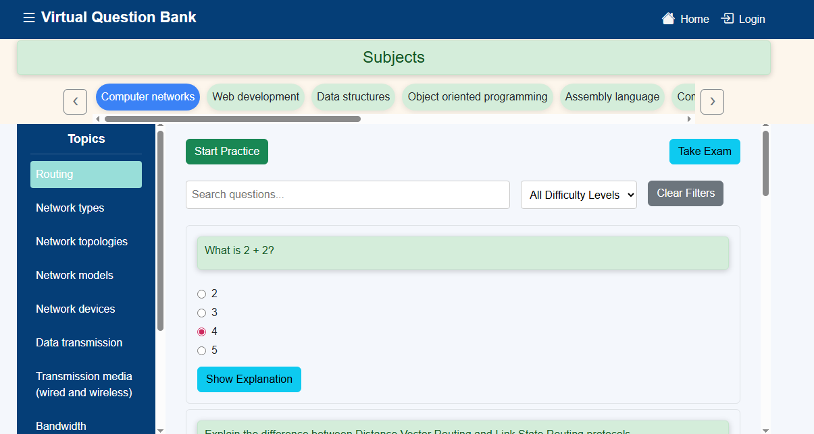
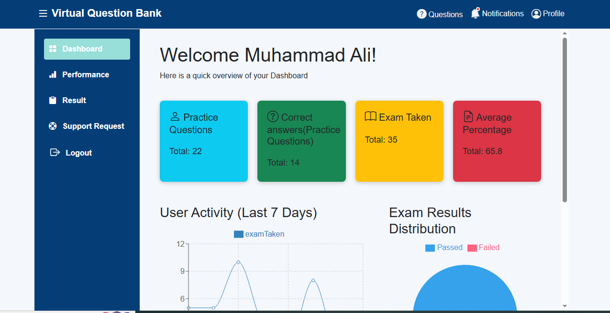
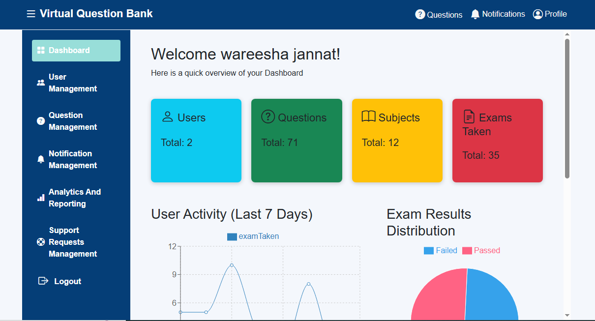
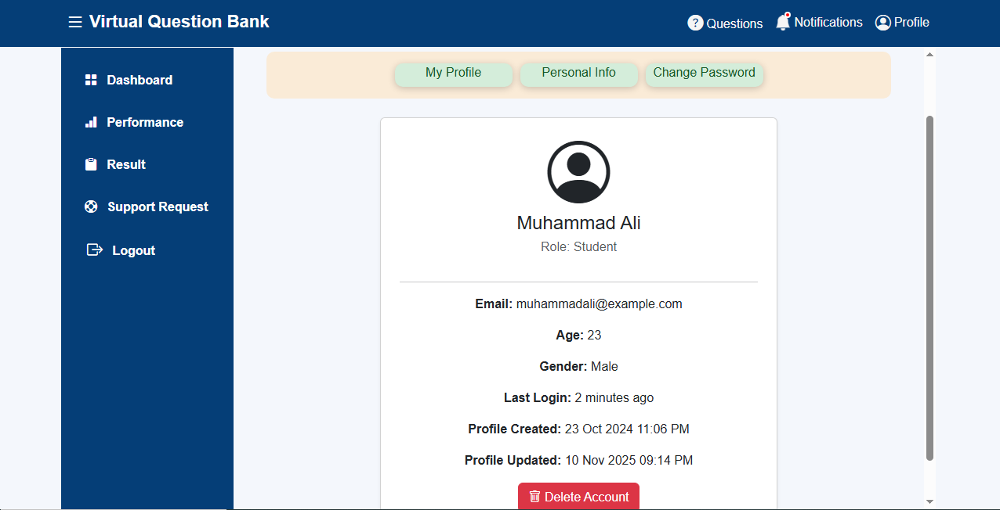
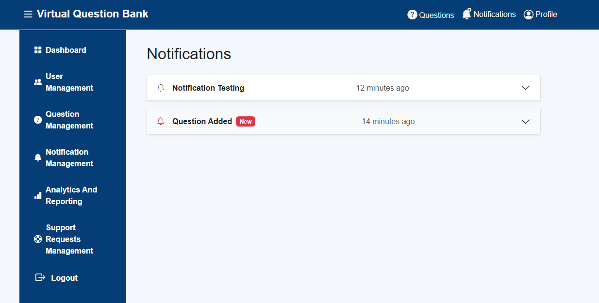

# 📝 Virtual Question Bank

<div align="center">

🎓 A web platform where students can practice and take exams, while admins manage questions, users, and system analytics.
Guest users can browse questions and view answers.

---

🖥️ **Built with:**  


</div>

---

## ✨ Features

### For Students

- 👤 Authentication & Profile – Sign up, login, and update profile info.
- 📚 Browse Questions – Questions organized by Subjects and Topics.
- Guests can view questions & answers only.
- Students can filter topics to see relevant questions.
- 📝 Practice & Exams – Attempt questions one by one or take full exams.
- 📊 Dashboard Metrics – Performance tracking with charts and graphs.
- 🆘 Support Requests – Submit requests to get help from admins.

### For Admins

- 🛠️ Content & User Management – Add/edit/delete questions, manage users.

- 📢 Notifications – Send announcements and view system-generated notifications.

- 📈 Analytics & Reports – View usage analytics, generate and download PDF reports.

- ❌ Exam Restriction – Admins cannot take exams or practice questions.

## 🖼️ Screenshots

### Homepage


### Question Page



### Student Dashboard



### Admin Dashboard



### Profile Page



### Notifications Page



## 🛠️ Tech Stack

- **Framework**: [Next.js](https://nextjs.org/) (Full-stack)
- **UI**: [React](https://react.dev/), [Bootstrap](https://bootstrap.com/)
- **Authentication**: Custom auth with JWT via backend middleware

---

## 🚀 Getting Started

1.  Clone the repo

```bash
git clone https://github.com/wareesha-Jannat/virtual-question-bank-frontend.git
cd virtual-question-bank-frontend

```

2.  Install dependencies

```bash
npm install
```

3. Start the development server:

```bash
npm run dev
```

## Test Account

Use the following credentials to explore the app :

### For Student

- **Email:** student@example.com
- **Password:** student@123

### For Admin

- **Email:** admin@example.com
- **Password:** admin@123

## Live Demo

[Visit the live site](https://boostme-henna.vercel.app)

## Credits

-<a href="https://www.flaticon.com/free-icons/question" title="question icons">Question icons created by Freepik - Flaticon</a>
